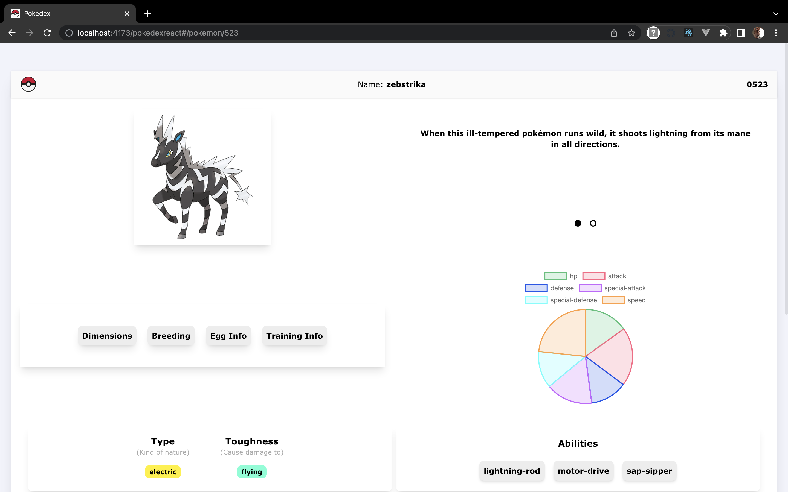

# Pokedex with react

## About

A website to view all pokemons and their details. UI made by me 😅

### Technologies

- Reactjs (Vite + Typescript)
- PokeApi RESTful api

## Screenshots

### Home Page

****

### Detail Page

****

## Notes

- Do not access the subroutes on url bar
- Any bug found, please create an issue or PR
