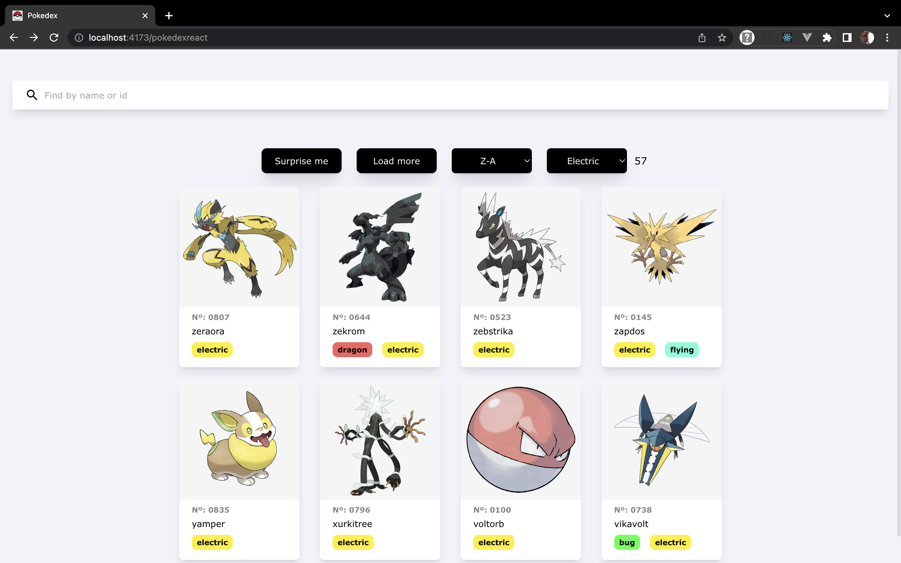

# Pokedex with react

## About

A website to view all pokemons and their details. UI made by me 😅

### Technologies

- Reactjs (Vite + Typescript)
- PokeApi RESTful api

## Screenshots

### Home Page

- [x] Render all pokemons card
- [x] Search pokemons by name
- [x] Search pokemons by id
- [ ] Filter pokemons by type
- [ ] Filter pokemons by ability

****

### Detail Page

- [x] Display pokemon image and name
- [x] Display pokemon height, weight, gender rate and capture rate
- [x] Display pokemon descriptions `in carousel`
- [x] Display pokemon stats (attack, hp, defense, speed, etc.)
- [x] Display pokemon types, weaknesses, resistances and abilities
- [x] Display pokemon evolution chain

****

## Notes

- Do not access the subroutes on url bar
- Any bug found, please create an issue or PR
- Before creating an issue or PR, first try to reload the page to see if the bug persist
